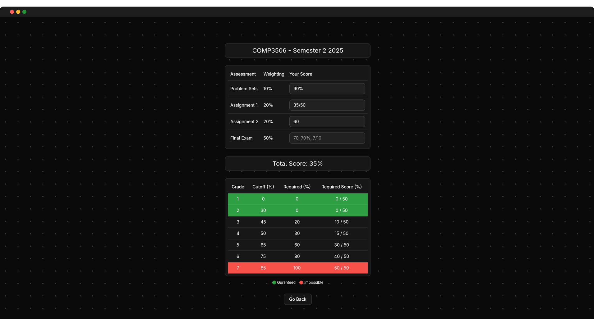

# UQGrades
UQ Grades is a tool which scrapes assessment criteria from the official UQ website for a course, and allows students to easily calculate possible final grades given their current marks for the course.

## How To Use
1. At the home page, enter course code, semester, and year and click "Find Course".
2. If the course offering for that course code, semester and year exist, the calculator page will be shown.
3. Then enter your current grade for each assessment as either a score, percentage or fraction.
4. The table will highlight green your guranteed final grade currently, and red what final grades are impossible.

## View Live
Try UQGrades yourself [here](https://uqgrades.vercel.app/).